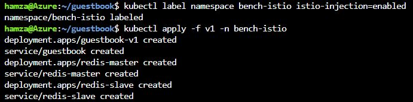
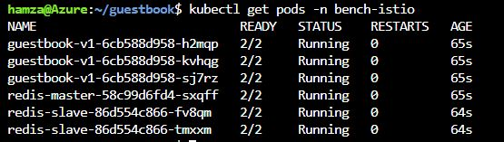
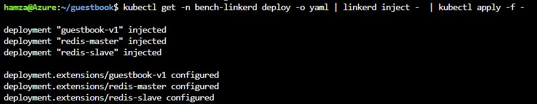
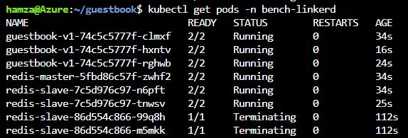
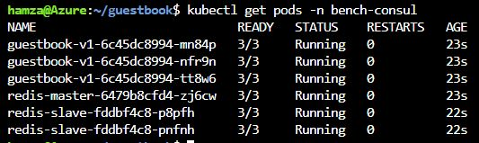

# Performance Benchmarking on Azure cluster

In this article we will try to benchmark the performance of kubernetes without service mesh injection, Consul, Linkerd, and Istio service meshes.

## Cluster infos:
The cluster that we are using is an Azure cluster AKS, Here is informations about our cluster :
- Cluster's **datacenter Region** : **East Us**
- Cluster contains **2 Nodes**
  Each node with 2 CPUs, 7 Memory
  Total: **Core 4 vCPUs** and **Memory 14 GiB**

  
## Benchmarking tool:
In our case, we are using **Fotio** as a benchmarking tool.
https://github.com/fortio/fortio

## Step 1: Organisation
- Before Beginning the Benchmarking, we need to organize things well, that's why we create for each service mesh a **namespace**.

- For the no service mesh example, we will use the namespace **default**.

## Step 2: Installation
### Application

- In our benchmarking we use guestbook application.
- This application is cloned from https://github.com/IBM/guestbook

### Apps deployment
#### Application with Istio deployment:
- **ps: We already installed Istio**
- Till we created a namespace for istio named bench-istio, we need to inject istio in this namespace, using:
kubectl label namespace bench-istio istio-injection=enabled
> after this command, when we deploy in this bench-istio namespace, kubernetes will inject utomatically an istio sidecar within the pods of this deployment. 

> **Now we can note that in each pod has 2/2 ready, and means that the pod contain 2 containers, the container image and the sidecar.**

#### Application with linkerd deployment:
- **ps: We already installed linkerd**
- in this deployment, we will use an imperative way to inject linkerd

> **Now we can note that in each pod has 2/2 ready, and means that the pod contain 2 containers, the container image and the sidecar.**
> For the 2 latest pod, there are terminating, means there are not in use anymore.

#### Application with Consul deployment:
- **ps: We already installed Consul**
- In this deployment, we will use a declarative way to inject consul inside our pods.
> In each deployment yaml file we added inside template the annotations: "Consul.hashicorp.com/connect-inject": "true".
Check app/consul-injection repository to take a look.
> After the deployment of consul yaml files, consul will inject 2 containers inside each pod
 

## Step 3: Low latency

- Fortio is software that can be installed in Windows, Unix or Mac Os.
- to get the lowest latency possible when we will benchmark our applications, we installed Fortio in an **Azure VM**

## Step 4: Testing

## Result: