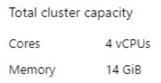
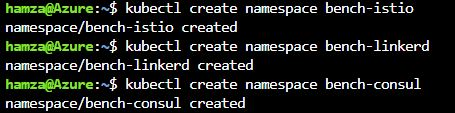

# Performance Benchmarking on Azure cluster

In this article we will try to benchmark the performance of kubernetes without service mesh injection, Consul, Linkerd, and Istio service meshes.

# Cluster infos:
The cluster that we are using is an Azure cluster AKS, Here is informations about our cluster :
- Cluster's **datacenter Region** : **East Us**
- Cluster contains **2 Nodes**
  Each node with 2 CPUs, 7 Memory
  Total: **Core 4 vCPUs** and **Memory 14 GiB**

  
# Benchmarking tool:
In our case, we are using **Fotio** as a benchmarking tool.
https://github.com/fortio/fortio

# Step 1: Organisation
- Before Beginning the Benchmarking, we need to organize things well, that's why we create for each service mesh a **namespace**.

- For the no service mesh example, we will use the namespace **default**.

# Step 2: Instalation
## test
### test2
#### test3

# Step 3: Low latency

# Step 4: Testing
Testing

# Result: