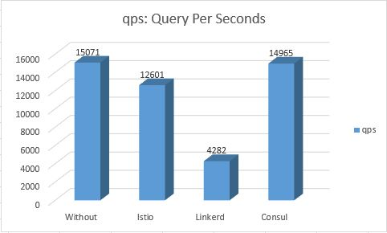

# Performance Benchmarking on Azure cluster

In this article we will try to benchmark the performance of kubernetes without service mesh injection, Consul, Linkerd, and Istio service meshes.

## Cluster infos:
The cluster that we are using is an Azure cluster AKS, Here is informations about our cluster :
- Cluster's **datacenter Region** : **East Us**
- Cluster contains **2 Nodes**
  Each node with 2 CPUs, 7 Memory
  Total: **Core 4 vCPUs** and **Memory 14 GiB**

  
## Benchmarking tool:
In our case, we are using **Fotio** as a benchmarking tool.
https://github.com/fortio/fortio

## Step 1: Organisation
- Before we begin the Benchmarking, we need to organize things well, that's why we create for each service mesh a **namespace**.

- For the no service mesh example, we will use the namespace **default**.

## Step 2: Installation
### Application

- In our benchmarking we use guestbook application.
- This application is cloned from https://github.com/IBM/guestbook

### Apps deployment
#### Application with Istio deployment:
- **ps: We already installed Istio**
- Till we created a namespace for istio named bench-istio, we need to inject istio in this namespace, using:
kubectl label namespace bench-istio istio-injection=enabled
> after this command, when we deploy in this bench-istio namespace, kubernetes will inject utomatically an istio sidecar within the pods of this deployment. 

> **Now we can note that in each pod has 2/2 ready, and means that the pod contain 2 containers, the container image and the sidecar.**

#### Application with linkerd deployment:
- **ps: We already installed linkerd**
- in this deployment, we will use an imperative way to inject linkerd

> **Now we can note that in each pod has 2/2 ready, and means that the pod contain 2 containers, the container image and the sidecar.**
> For the 2 latest pod, there are terminating, means there are not in use anymore.

#### Application with Consul deployment:
- **ps: We already installed Consul**
- In this deployment, we will use a declarative way to inject consul inside our pods.
> In each deployment yaml file we added inside template the annotations: "Consul.hashicorp.com/connect-inject": "true".
Check app/consul-injection repository to take a look.
> After the deployment of consul yaml files, consul will inject 2 containers inside each pod
 

#### Services:
- After the deployment of the applications, we will use the external ip of each service to test each service mesh.
- This image contains external and port of each application taht we will use.

## Step 3: Low latency

- Fortio is software that can be installed in Windows, Unix or Mac Os.
- to get the lowest latency possible when we will benchmark our applications, we installed Fortio in an **Azure VM**

## Step 4: Testing

In the privious steps, we created 4 namespaces, 4 aplications each application for a service mesh, we installed Fortio inside an Azure VM.
Now we will connect to our virtual machine using SSH for using our benchmarking software.

To benchmark the applications, we will use **Connections** and **qps: Query per seconds**. and we will test how much connections and query per seconds can our application supports.

To do that we will use the command:
> fortio load -c <Number of connections> -qps <number of qps> -t <time> http://ip:port

- The command can give in how much time can our server load 50%, 75%, 99% and 99.9% of our applications 
- In our tests we will use -qps 0, fortio will consider 0 like try to reach the maximum qps possible.
### Test 1: 400 Connections for 10 seconds
In our first test, we used 400 connections, and we will test if all the service meshes can resist.
> command: **fortio load -c 400 -qps 0 -t 10 http://externalIp:3000**, ip will be modified for each service

#### No Service mesh: 

The image show that:
- The server can respond to **15 200 qps**.
- The server load 99.9p of the application in **13.9 ms**.

#### Istio: 

The image show that:
- The server can respond to **13 056 qps**.
- The server load 99.9p of the application in **15.5 ms**.

#### Consul: 

The image show that:
- The server can respond to **14 747 qps**.
- The server load 99.9p of the application in **18.66 ms**.

#### Linkerd: 

The image show that:
- The server can respond to **5 734 qps**.
- The server load 99.9p of the application in **48.92 ms**.

### Test 2: 1000 Connections for 180 seconds
In the second test, we used 1000 connections, and we will test if all the service meshes can resist.
> command: **fortio load -c 1000 -qps 0 -t 180 http://<ip>:3000**, ip will be modified for each service

#### No Service mesh: 

The image show that:
- The server can respond to **15 071 qps**.
- The server load 99.9p of the application in **32.4 ms**.

#### Istio: 

The image show that:
- The server can respond to **12 601 qps**.
- The server load 99.9p of the application in **32.7 ms**.

#### Consul: 

The image show that:
- The server can respond to **14 965 qps**.
- The server load 99.9p of the application in **35.5 ms**.

#### Linkerd: 

The image show that:
- The server can respond to **4 282 qps**.
- The server load 99.9p of the application in **71.67 ms**.

## Result:

#### Query per seconds comparison:

#### Application loading per seconds:

## Conclusion:

- From the tests we conclude that linkerd take more time to load the application +100%.
- Without using a service mesh or using consul, the server can respond to qps 25% better than istio, and 350% better than Linkerd.

-But! another performance benchmarking test of istio and linkerd shared on https://medium.com/@ihcsim/linkerd-2-0-and-istio-performance-benchmark-df290101c2bb 
shows that linkerd perform better than Istio, in our test we conclude the inverse.