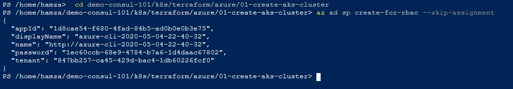

# Consul in Azure AKS

This repository is the first consul installation in aks.

## Azure AKS Configuration
- First thing we need to do is to create an azure cluster. 
- In this section we are using Terraform. Terraform is an open-source infrastructure as code software tool created by HashiCorp. It enables users to define and provision a datacenter infrastructure using a high-level configuration language
- We can use azure portal or Azure clous shell to configure aks, in this tutorial we will use just Azure cloud shell.

### Prerequisites:
This tutorial based on github repository: https://github.com/hashicorp/demo-consul-101, and HashiCorp's tutorial https://learn.hashicorp.com/consul/kubernetes/azure-k8s
Clone it using azure shell:

### Create AKS Cluster:

To create our consul cluster, we will use our cloned repository.
- Switch to demo-consul-101/k8s/terraform/azure/01-create-aks-cluster
> 01-create-aks-cluster repository contains 2 terraform files **aks-cluster.tf**, and **versions.tf**
> Those files will be used to initialize our terraform.
- Run the az command with the following arguments to create an Active Directory service principal account.
$ **az ad sp create-for-rbac --skip-assignment**

- Open new terraform.tfvars file and add appId and password variables on it.
	**Code terraform.tfvars**, you can use any file editor.

- Initialize terraform:

- Terraform apply: using appId and password

Ps: It will take some 10min to setup the cluster
Result: The creation of k8s cluster and resource group!

### Enable the k8s dashboard:
In order to use the Kubernetes dashboard, we need to create a ClusterRoleBinding:
Using the command :
> $ kubectl create clusterrolebinding kubernetes-dashboard --clusterrole=cluster-admin --serviceaccount=kube-system:kubernetes-dashboard

View the k8s dashboard using the command:
> 	az aks browse --resource-group groupName --name clusterName

### Consul configuration:

Now we are ready to install Consul to the cluster.
Consul installation using Helm:
- Move to $ **cd ~/demo-consul-101/k8s**
- Clone the consul-helm project inside the k8s directory so that Consul can be installed.
> $ git clone https://github.com/hashicorp/consul-helm.git
-	We can now use helm to install Consul using the consul-helm chart that we are cloned.

- We can use some Kubernetes commands to check consult’s deployments and pods that are created:

-	We can access to Consul dashboard by using exernal ip of consul ui service.

In our case the external ip is: 52.183.76.198
-	Using dashboard:

### Deploy Microservices using consul:

In this example we are using a simple microservice example provided by HashiCorp.
On the repository “demo-consul-101/k8s/04-yaml-connect-envoy/”, we have 2 yaml files
-	couting-service.yaml contains a pod configuration
this pod use a docker image “hashicorp/counting-service:0.0.2” with containerPort: 9001

- dashboard-service.yaml contains pod and service configuration
1. This pod uses a docker image “hashicorp/dashboard-service:0.0.4” with containerPort 9002 and in the environment persist the container service URL of the first pod localhost:9001.
2. The service give us a load balancing and an external IP address to access our application outside the cluster using browser.
Now we need to apply our yaml files using the command **kubectl apply -f 04-yaml-connect-envoy**

And now our application is available outside the cluster by using the external IP address 13.66.131.63:

Result:

